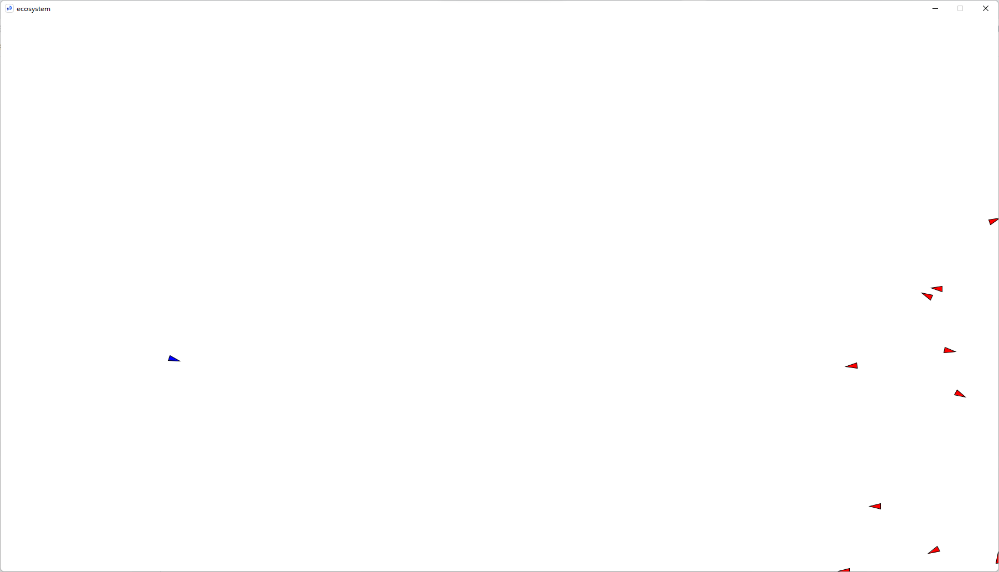
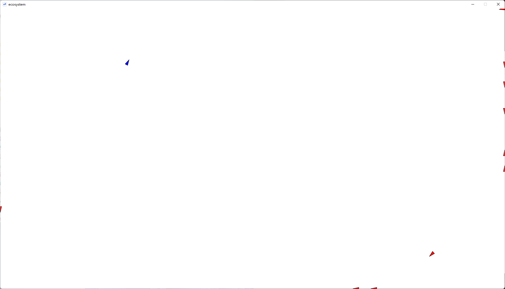

# Ecology Project

This is a project that aims to simulate a virtual ecosystem with digital creatures interacting with each other.

## Overview

The code simulates the situation where a predator attempts to hund down the preys. From the start, their locations are randomly generated. For each prey, they are constantly running away from the predator. On the other hand, the predator locates the nearest prey at any given time and chase it down at a higher speed. However, the prey being chased will escape from the predator at a even higher speed because of its survival instincts. The preys has smaller weights so that they are more agile while the predator is more heavy.

Right now, only the chasing part is done. In the future, I want to add features like preys being eaten by the predator, predator staying idle after a feast, and both preys and predators will reproduce and age.

## Code Highlights

1. **Transition of displayed color**
   The preys would have a newborn color of green (15, 155, 15) and a aging color of black (0, 0, 0). Every second, the preys would age 1, which in turn would cause a transition from green to black. Each prey was assigned with a random maximum age. Every second, the percentage of life lived by the prey would be calculated and in turn infer a color on the gradient, which will be the displayed color on screen.

2. **Hunger Level Indicator**
   As each individual has its own hunger value, it would be undesirable to display all of them at once on the screen. I chose to change the stroke color, i.e. to have a red line stroke, of the triangle to indicate that the creature has reaches a critical hunger level.

3. **Food Generator with Perlin Noise**
   Naturally, the food generation follows a cycle, with troughs and peaks. The food generator aims to mimic such generation behavior by introducing a Perlin noise to simulate natural fluctuations in food productions. Every 5 seconds, the time elapsed would be passed into the function which gives a semi-random number that is adjacent to the previous one. Thus achieving the effect of imitating natural cycles of food productions. In the future, I may introduce Perlin noise to locations as well.

4. **DNA Passed Down in Reproduction**
   There are some random attributes for each creature, like max age, initial mass. These attributes can be passed down to its offspring by mixing the chatacteristics from the parents. More attributes to be introduced to the creatures.

## Lessons Learned

Here are some of the hurdles I encountered during the implementation of the ecosystem, their solution or workarounds are documented if possible.

- Displaying images instead of a mere shape is also tricky since we want it to always orient to the right direction. For now, I am only using colored triangles to denote preys and predators.

- Displaying as much information as we want it to without occupying the screen (which blocks our view of creatures moving around) is delicate. Here, I chose to indicate the age of each prey by changing its color over a spectrum. In other words, the prey would "born" with a light green color, and its color will gradually transition in each frame as it ages towards its maximum age. The final color is black, which means it deceases. Detailed information in code highlights.

- Determinig the type of force depends on the desired bevahiors. For the two types of forces: the attraction(repel) force and steering force. The former acts on acceleration, which gradually speeds up/down and turns direction. The latter is more immediate and target oriented. In the project, I chose steering force as the type of force for foraging food, while attraction/repel force are for staying away from enemies / staying close to peers.

## Screenshots

## Video

[Link to video](https://drive.google.com/file/d/1tZauoaTW1oDxC6otW7bPnm6xuqH-a3k3/view?usp=sharing)
